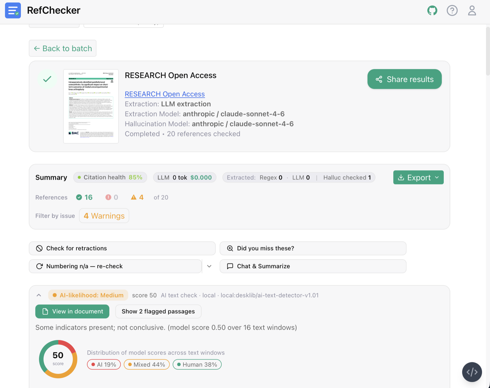

# RefChecker

Validate reference accuracy in academic papers. Useful for authors checking bibliographies and reviewers ensuring citations are authentic. RefChecker verifies citations against Semantic Scholar, OpenAlex, and CrossRef.

*Built by Mark Russinovich with AI assistants (Cursor, GitHub Copilot, Claude Code). [Watch the deep dive video](https://www.youtube.com/watch?v=n929Alz-fjo).*

## Contents

- [Quick Start](#quick-start)
- [Features](#features)
- [Sample Output](#sample-output)
- [Install](#install)
- [Run](#run)
  - [Web UI](#web-ui)
  - [Multi-User Hosted Server (OAuth)](#multi-user-hosted-server-oauth)
  - [Docker](#docker)
  - [CLI](#cli)
- [Output](#output)
- [Configure](#configure)
- [Local Database](#local-database)
- [Testing](#testing)
- [License](#license)

## Quick Start

### Web UI (Docker)

```bash
docker run -p 8000:8000 ghcr.io/markrussinovich/refchecker:latest
```

Open **http://localhost:8000** in your browser.

### Web UI (pip)

```bash
pip install academic-refchecker[llm,webui]
refchecker-webui
```

### CLI (pip)

```bash
pip install academic-refchecker[llm]
academic-refchecker --paper 1706.03762
academic-refchecker --paper /path/to/paper.pdf
```

> **Performance**: Set `SEMANTIC_SCHOLAR_API_KEY` for 1-2s per reference vs 5-10s without.

## Features

- **Multiple formats**: ArXiv papers, PDFs, LaTeX, text files
- **LLM-powered extraction**: OpenAI, Anthropic, Google, Azure, vLLM
- **Multi-source verification**: Semantic Scholar, OpenAlex, CrossRef
- **Comprehensive checks**: Titles, authors, years, venues, DOIs, ArXiv IDs
- **Smart matching**: Handles formatting variations (BERT vs B-ERT, pre-trained vs pretrained)
- **Detailed reports**: Errors, warnings, corrected references
- **Bulk web checks**: Upload multiple files or a ZIP in the Web UI to validate many papers at once

## Sample Output

**Web UI**



**CLI**

```
📄 Processing: Attention Is All You Need
   URL: https://arxiv.org/abs/1706.03762

[1/45] Neural machine translation in linear time
       Nal Kalchbrenner et al. | 2017
       ⚠️  Warning: Year mismatch: cited '2017', actual '2016'

[2/45] Effective approaches to attention-based neural machine translation
       Minh-Thang Luong et al. | 2015
       ❌ Error: First author mismatch: cited 'Minh-Thang Luong', actual 'Thang Luong'

[3/45] Deep Residual Learning for Image Recognition
       Kaiming He et al. | 2016 | https://doi.org/10.1109/CVPR.2016.91
       ❌ Error: DOI mismatch: cited '10.1109/CVPR.2016.91', actual '10.1109/CVPR.2016.90'

============================================================
📋 SUMMARY
📚 Total references processed: 68
❌ Total errors: 55  ⚠️ Total warnings: 16  ❓ Unverified: 15
```

## Install

### PyPI (Recommended)

```bash
pip install academic-refchecker[llm,webui]  # Web UI + CLI + LLM providers
pip install academic-refchecker             # CLI only
```

### From Source (Development)

```bash
git clone https://github.com/markrussinovich/refchecker.git && cd refchecker
python -m venv .venv && source .venv/bin/activate
pip install -e ".[llm,webui]"
```

**Requirements:** Python 3.7+ (3.10+ recommended). Node.js 18+ is only needed for Web UI development.

## Run

### Web UI

The Web UI shows live progress, history, and export (including corrected values).

```bash
refchecker-webui --port 8000
```

*Tip: You can bulk-check multiple papers by selecting several files or a single ZIP; the Web UI will group them into a batch in the history sidebar.*

#### Development (frontend)

```bash
cd web-ui
npm install
npm start
```

Open **http://localhost:5173**.

Alternative (separate servers):

```bash
# Terminal 1
python -m uvicorn backend.main:app --reload --port 8000

# Terminal 2
cd web-ui
npm run dev
```

Verify the backend is running:

```bash
curl http://localhost:8000/
```

Web UI documentation: see [web-ui/README.md](web-ui/README.md).

### Multi-User Hosted Server (OAuth)

By default, RefChecker runs in **single-user mode** — no login required. To enable multi-user mode with OAuth authentication, set the `REFCHECKER_MULTIUSER=true` environment variable. In this mode every visitor must sign in via OAuth (Google, GitHub, or Microsoft) before using the app. LLM API keys are entered once by each user in the Settings panel, saved in the **browser's `localStorage`**, and sent in the request body on every check — they are never stored on the server.

#### 1. Generate a JWT Secret Key

```bash
python -c "import secrets; print(secrets.token_hex(32))"
```

Copy the output — this is your `JWT_SECRET_KEY`.

#### 2. Register an OAuth Application

Configure **at least one** provider:

**Google** — [Google Cloud Console](https://console.cloud.google.com/apis/credentials) → *Create credentials → OAuth 2.0 Client ID → Web application*
- Authorised redirect URI: `https://<your-domain>/api/auth/callback/google`

**GitHub** — [GitHub Settings › Developer settings › OAuth Apps](https://github.com/settings/developers) → *New OAuth App*
- Authorization callback URL: `https://<your-domain>/api/auth/callback/github`

**Microsoft** — [Azure portal › App registrations](https://portal.azure.com/#view/Microsoft_AAD_RegisteredApps) → *New registration*
- Redirect URI: `https://<your-domain>/api/auth/callback/microsoft`

#### 3. Configure Environment Variables

```bash
git clone https://github.com/markrussinovich/refchecker.git && cd refchecker
cp .env.example .env
```

Edit `.env` with your values:

```ini
# Enable multi-user mode
REFCHECKER_MULTIUSER=true

# Required
JWT_SECRET_KEY=<output from step 1>
SITE_URL=https://<your-domain>
HTTPS_ONLY=true

# At least one OAuth provider (add whichever you registered in step 2)
GOOGLE_CLIENT_ID=...
GOOGLE_CLIENT_SECRET=...

GITHUB_CLIENT_ID=...
GITHUB_CLIENT_SECRET=...

MS_CLIENT_ID=...
MS_CLIENT_SECRET=...

# Optional tuning
ADMIN_EMAILS=your@email.com   # also grants admin to specific emails (first user is auto-admin)
MAX_CHECKS_PER_USER=3         # max concurrent checks per user (default: 3)
```

#### 4. Launch with Docker Compose

```bash
docker compose up -d
```

The server starts on port **8000**. Place it behind a TLS-terminating reverse proxy (nginx, Caddy, etc.) for HTTPS.

Verify it is running:

```bash
curl http://localhost:8000/api/auth/providers
# {"providers":["google","github"]}
```

#### Local / Development Launch

Without Docker:

```bash
pip install "academic-refchecker[llm,webui]"
REFCHECKER_MULTIUSER=true JWT_SECRET_KEY=<secret> GOOGLE_CLIENT_ID=... GOOGLE_CLIENT_SECRET=... \
  refchecker-webui --port 8000
```

Or with hot-reload for development:

```bash
# Terminal 1 — API
REFCHECKER_MULTIUSER=true JWT_SECRET_KEY=<secret> GOOGLE_CLIENT_ID=... GOOGLE_CLIENT_SECRET=... \
  python -m uvicorn backend.main:app --reload --port 8000

# Terminal 2 — Frontend (http://localhost:5173)
cd web-ui && npm run dev
```

> **Tip:** You can also place these variables in a `.env` file (see `.env.example`). The server loads it automatically on startup.

#### Notes

- **Admin access**: The first user to sign in is automatically granted admin rights. Additional admins can be designated via the `ADMIN_EMAILS` env var (comma-separated list of email addresses).
- **LLM API keys**: Each user enters their own key in *Settings → API Keys*. Keys are saved in `localStorage` and sent per-request in the request body — never stored on or logged by the server.
- **Rate limiting**: Each user may run up to `MAX_CHECKS_PER_USER` concurrent checks (default 3). The 4th simultaneous request returns HTTP 429.
- **Single-user mode**: Without `REFCHECKER_MULTIUSER=true`, the server runs in single-user mode with no login screen — ideal for local use and the CLI.
- **CLI mode is unaffected**: `academic-refchecker` (CLI) does not require OAuth and continues to work without any auth configuration.

### Docker

Pre-built multi-architecture images are published to GitHub Container Registry on every release.

#### Quick Start

```bash
docker run -p 8000:8000 ghcr.io/markrussinovich/refchecker:latest
```

Open **http://localhost:8000** in your browser.

#### With LLM API Key

Pass your API key for LLM-powered reference extraction (recommended):

```bash
# Anthropic Claude (recommended)
docker run -p 8000:8000 -e ANTHROPIC_API_KEY=your_key ghcr.io/markrussinovich/refchecker:latest

# OpenAI
docker run -p 8000:8000 -e OPENAI_API_KEY=your_key ghcr.io/markrussinovich/refchecker:latest

# Google Gemini
docker run -p 8000:8000 -e GOOGLE_API_KEY=your_key ghcr.io/markrussinovich/refchecker:latest
```

#### Persistent Data

Mount a volume to persist check history and settings between restarts:

```bash
docker run -p 8000:8000 \
  -e ANTHROPIC_API_KEY=your_key \
  -v refchecker-data:/app/data \
  ghcr.io/markrussinovich/refchecker:latest
```

#### Docker Compose

For easier configuration with an `.env` file:

```bash
git clone https://github.com/markrussinovich/refchecker.git && cd refchecker
cp .env.example .env  # Add your API keys
docker compose up -d
```

Common commands:

```bash
docker compose logs -f    # View logs
docker compose down       # Stop
docker compose pull       # Update to latest
```

#### Available Tags

| Tag | Description | Arch | Size |
|-----|-------------|------|------|
| `latest` | Latest stable release | amd64, arm64 | ~800MB |
| `X.Y.Z` | Specific version (e.g., `2.0.18`) | amd64, arm64 | ~800MB |

#### Deploy to Render

RefChecker includes a [`render.yaml`](render.yaml) Blueprint for one-click deployment to [Render](https://render.com):

1. Fork this repo (or connect your own copy).
2. On Render, click **New +** → **Blueprint** → select the repo.
3. Render reads `render.yaml` and creates the service with a persistent disk.
4. Set the required environment variables in the Render dashboard:
   - `SITE_URL` — your Render app URL (e.g., `https://refchecker-xxxx.onrender.com`)
   - At least one OAuth provider's `CLIENT_ID` / `CLIENT_SECRET`
5. Register each provider's callback URL as `https://<your-url>/api/auth/callback/{google,github,microsoft}`.

> **Note:** Render assigns the `PORT` dynamically — the app reads it automatically. The persistent disk at `/data` stores the SQLite database and uploaded files, so data survives redeployments. For other PaaS hosts (Railway, Fly.io), the same Docker image works — just set `PORT`, `REFCHECKER_DATA_DIR`, and the auth env vars.

### CLI

```bash
# ArXiv (ID or URL)
academic-refchecker --paper 1706.03762
academic-refchecker --paper https://arxiv.org/abs/1706.03762

# Local files
academic-refchecker --paper paper.pdf
academic-refchecker --paper paper.tex
academic-refchecker --paper paper.txt
academic-refchecker --paper refs.bib

# Faster/offline verification (local DB)
academic-refchecker --paper paper.pdf --db-path semantic_scholar_db/semantic_scholar.db

# Save results
academic-refchecker --paper 1706.03762 --output-file errors.txt
```

## Output

RefChecker reports these result types:

| Type | Description | Examples |
|------|-------------|----------|
| ❌ **Error** | Critical issues needing correction | Author/title/DOI mismatches, incorrect ArXiv IDs |
| ⚠️ **Warning** | Minor issues to review | Year differences, venue variations |
| ℹ️ **Suggestion** | Recommended improvements | Add missing ArXiv/DOI URLs, small metadata fixes |
| ❓ **Unverified** | Could not verify against any source | Rare publications, preprints |

Verified references include discovered URLs (Semantic Scholar, ArXiv, DOI). Suggestions are non-blocking improvements.

<details>
<summary>Detailed examples</summary>

```
❌ Error: First author mismatch: cited 'T. Xie', actual 'Zhao Xu'
❌ Error: DOI mismatch: cited '10.5555/3295222.3295349', actual '10.48550/arXiv.1706.03762'
⚠️ Warning: Year mismatch: cited '2024', actual '2023'
ℹ️ Suggestion: Add ArXiv URL https://arxiv.org/abs/1706.03762
❓ Could not verify: Llama guard (M. A. Research, 2024)
```

</details>

## Configure

### LLM

LLM-powered extraction improves accuracy with complex bibliographies. Claude Sonnet 4 performs best; GPT-4o may hallucinate DOIs.

| Provider | Env Variable | Example Model |
|----------|--------------|---------------|
| Anthropic | `ANTHROPIC_API_KEY` | `claude-sonnet-4-20250514` |
| OpenAI | `OPENAI_API_KEY` | `gpt-5.2-mini` |
| Google | `GOOGLE_API_KEY` | `gemini-3` |
| Azure | `AZURE_OPENAI_API_KEY` | `gpt-4o` |
| vLLM | (local) | `meta-llama/Llama-3.3-70B-Instruct` |

```bash
export ANTHROPIC_API_KEY=your_key
academic-refchecker --paper 1706.03762 --llm-provider anthropic

academic-refchecker --paper paper.pdf --llm-provider openai --llm-model gpt-5.2-mini
academic-refchecker --paper paper.pdf --llm-provider vllm --llm-model meta-llama/Llama-3.3-70B-Instruct
```

#### Local models (vLLM)

There is no separate “GPU Docker image”. For local inference, install the vLLM extra and run an OpenAI-compatible vLLM server:

```bash
pip install "academic-refchecker[vllm]"
python scripts/start_vllm_server.py --model meta-llama/Llama-3.3-70B-Instruct --port 8001
academic-refchecker --paper paper.pdf --llm-provider vllm --llm-endpoint http://localhost:8001/v1
```

### Command Line

```bash
--paper PAPER              # ArXiv ID, URL, or file path
--llm-provider PROVIDER    # openai, anthropic, google, azure, vllm
--llm-model MODEL          # Override default model
--db-path PATH             # Local database for offline verification
--output-file [PATH]       # Save results (default: reference_errors.txt)
--debug                    # Verbose output
```

### Environment Variables

```bash
# LLM
export REFCHECKER_LLM_PROVIDER=anthropic
export ANTHROPIC_API_KEY=your_key           # Also: OPENAI_API_KEY, GOOGLE_API_KEY

# Performance
export SEMANTIC_SCHOLAR_API_KEY=your_key    # Higher rate limits / faster verification
```

## Local Database

For offline verification or faster processing:

```bash
python scripts/download_db.py \
  --field "computer science" \
  --start-year 2020 --end-year 2024

academic-refchecker --paper paper.pdf --db-path semantic_scholar_db/semantic_scholar.db
```

## Testing

490+ tests covering unit, integration, and end-to-end scenarios.

```bash
pytest tests/                    # All tests
pytest tests/unit/              # Unit only
pytest --cov=src tests/         # With coverage
```

See [tests/README.md](tests/README.md) for details.

## License

MIT License - see [LICENSE](LICENSE).
