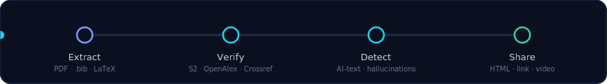
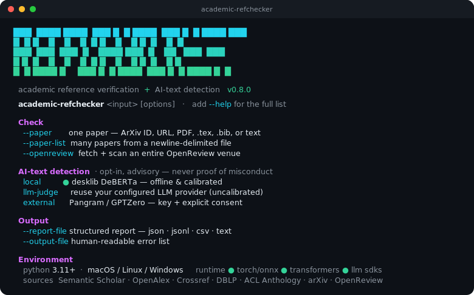

# RefChecker

<p align="center">
  
</p>

<p align="center">
  <strong>Validate reference accuracy in academic papers.</strong><br>
  Catch citation errors, fabricated references, and metadata mismatches before they reach reviewers.
</p>

<p align="center">
  
</p>

<p align="center">
  <a href="#quick-start">Quick Start</a> •
  <a href="#features">Features</a> •
  <a href="#web-ui">Web UI</a> •
  <a href="#cli">CLI</a> •
  <a href="#hallucination-detection">Hallucination Detection</a> •
  <a href="#deployment">Deployment</a>
</p>

<p align="center">
  <a href="https://github.com/ArioMoniri/refchecker/releases/latest/download/RefChecker-macos-arm64.dmg">
    
  </a>
  &nbsp;
  <a href="https://github.com/ArioMoniri/refchecker/releases/latest/download/RefChecker-windows-x64.msi">
    
  </a>
</p>

<p align="center">
  <sub>
    Linux: <a href="https://github.com/ArioMoniri/refchecker/releases/latest/download/RefChecker-linux-x64.AppImage">.AppImage</a> ·
    <a href="https://github.com/ArioMoniri/refchecker/releases/latest/download/RefChecker-linux-x64.deb">.deb</a> ·
    <a href="https://github.com/ArioMoniri/refchecker/releases/latest">all builds</a>
  </sub>
</p>

<p align="center">
  <sub>Native desktop builds powered by <a href="tauri-app/">Tauri</a> · Built and signed by GitHub Actions on every release tag.</sub>
</p>

### ✨ What the desktop app adds

The desktop app wraps the same engine in a native Tauri shell and layers on a full
review workspace. **The highlights below are grouped and collapsed** — click any
section to expand it.

> **Newest in v0.7.x** — **AI-generated-text detection** with rich visualizations ·
> **Share & export** (HTML report, public link, video) · an **Obsidian-style 3D graph**
> of your whole reference library · a **native-feeling document viewer** with zoom + find ·
> **richer author cards** · and a **run-mode switch** (references only / AI only / both).

<details>
<summary><strong>🤖 AI-generated-text detection</strong> — opt-in, advisory, never proof of misconduct</summary>

<br>

- **Three engines, your choice.** A **local calibrated model** (desklib DeBERTa-v3, MIT — runs offline after a one-time download), an **LLM-judge** that reuses your hallucination-check provider, or an **external API** (Pangram / GPTZero, key + explicit consent required).
- **GPTZero-style visualizations.** A confidence **donut**, **AI / Mixed / Human** probability pills, a **page-by-page** likelihood breakdown, and **Top AI / Top Human** sentence lists — all descriptive of the model's windowed scores, never a probability of guilt.
- **Flagged passages, in context.** Click any advisory passage to **see it highlighted in the document**, with zoom + find.
- **Run mode.** Settings → *Run mode* lets you check **references only** (default), **AI text only** (skips reference verification entirely), or **both**.
- **Honesty-first.** A permanent disclaimer, distinct *inconclusive* / *unavailable* states, and abstention on short or highly technical text. The model is cited in-app and in [Sources & credits](#sources--credits).

</details>

<details>
<summary><strong>📤 Share, export & document viewing</strong></summary>

<br>

- **Share this document.** One click produces a **self-contained HTML report** (references + verdicts + AI-detection visuals, all inline) you can download and send anywhere.
- **Publish a link.** Opt-in *Publish to web* pushes the report to a host (GitHub Gist → viewable link) so *anyone with the link* can view the results.
- **Video walkthrough.** Export an in-app **animated WebM** of the verdict gauge, reference stats, and AI band — no external tools, no screen-share.
- **Native-feeling document viewer.** The extracted body renders as a centered, serif **"page"** with flagged passages highlighted in place, plus **zoom** and an in-document **find** bar (⌘F, match navigation).
- **PDF page viewer with zoom.** Browse the original PDF pages full-screen with +/- zoom and fit.
- **Reference-manager export (RIS).** Imports straight into **Zotero**, **EndNote**, **Mendeley**, **Rayyan**, **Papers**, and **RefWorks** — with the verifier's *corrected* metadata, not the wrong-as-cited values. Includes a *Sort* control (citation order / alphabetical / year).

</details>

<details>
<summary><strong>🕸️ Graphs & the reference library</strong></summary>

<br>

- **Obsidian-style 3D library graph.** Visualize **every reference you've ever verified** as a 3D force-directed graph — node size = how many times it's been seen, edges = shared authors / venue.
- **Real per-paper citation graph.** Force-directed view of one paper's bibliography, edges from the **real Semantic Scholar citation graph** (A → B iff A cites B), nodes sized by **in-paper in-degree**. Double-click a node to expand one hop further; toggle an **AI-likelihood ring** on the nodes.
- **Global reference library (Seen References).** Every verified reference is persisted to a global identity cache (DOI / arXiv / normalized-title key) and consulted automatically for instant matches. Live-refreshing, searchable, and clearable.
- **Find similar papers — multi-source, actively verified.** Candidates from **Semantic Scholar**, **OpenAlex**, your **web-search provider**, and your **default LLM**, deduped with source badges and *re-verified* before display — real ✓ verified / ? unconfirmed, not just metadata.

</details>

<details>
<summary><strong>✏️ Corrections, citation styles & live health</strong></summary>

<br>

- **Add / Remove / Suggest alternative — everywhere.** In both the References and Corrections tabs. *Apply Fix* merges the verifier's suggested metadata and **re-verifies live**, so the ref flips to *verified* and the health chip moves in real time (apply-all parallelizes 4 in flight).
- **Suggest alternative** combines an LLM "what real paper did they mean?" with Semantic Scholar title-search — **each candidate rendered in your selected citation style** with one-click Copy.
- **Live citation-health chip.** A minimal Grammarly-style score in the Summary header — color-coded, hover for a breakdown, recomputes on every edit, copyable as a Markdown badge.
- **Tunable citation styles + custom-style builder.** APA / IEEE / Vancouver / etc. expose Max-authors, et-al threshold, and Include-URL toggles; save a custom template like `{authors} ({year}). {title}. {venue}. {doi}`.
- **Author cards on hover.** Hovering an author shows **affiliation, paper & citation counts, h-index, homepage, and recent papers** (Semantic Scholar, cached). An **inline-cited ✓ badge** marks references actually cited in the body text.

</details>

<details>
<summary><strong>⚙️ Extraction, cost tracking & quality-of-life</strong></summary>

<br>

- **Cascade extraction (token saver).** *Reference Extraction* picks **cascade** (regex / BibTeX / GROBID first, LLM only on messy entries) or **LLM-only** — typically 60–90% fewer LLM tokens on well-formatted papers.
- **LLM token + cost meter.** Tracks tokens and an estimated USD cost across every provider, with per-provider and per-kind breakdowns and a cascade-savings hint. Persists across restarts.
- **Citation context.** Each card shows the sentence where the reference is cited — numeric `[12]` **and** author-year `(Smith et al., 2020)` styles, with a retry/fallback that also catches narrative & title-mention citations.
- **Batch workspace.** Run hundreds of papers, with a batch summary view, per-paper status, expand/collapse-all, and aggregate counters.
- **Drag-and-drop + Open With.** Drop a PDF / DOCX / ODT / RTF / Markdown / HTML / BibTeX / LaTeX / text file — or right-click → RefChecker in Finder/Explorer — and the check starts immediately.
- **Auto-updating, signed builds.** Native installers for macOS / Windows / Linux, signed and shipped by GitHub Actions on every release tag, with a built-in updater.

</details>

---

RefChecker verifies citations against **Semantic Scholar**, **OpenAlex**, **CrossRef**, **DBLP**, and **ACL Anthology**, and uses LLM-powered deep web search to flag likely fabricated references. When the LLM finds a more likely source than the first database match, RefChecker re-verifies the citation against the LLM-found metadata before deciding whether it is an error or a hallucination. It supports single papers, bulk batches, and automated scanning of entire OpenReview venues.

*Built by Mark Russinovich with AI assistants (Cursor, GitHub Copilot, Claude Code). [Watch the deep dive video](https://www.youtube.com/watch?v=n929Alz-fjo).*

---

## 🆕 Recent updates

<details open>
<summary><strong>Latest release highlights</strong> (desktop app)</summary>

<br>

- **v0.8.1** — Fixes: **Share → Download HTML** now produces a complete report (was 500 / empty references); **AI detection no longer skipped** for some papers in bulk; author-matching tolerates **surname typos** (`Guruprasad`↔`Guruprashad`) and a **small omission** in an otherwise-correct author list; the **session token/$ meter** no longer resets mid-run. UX: PDF viewer **zoom moved to the side** + **⌘F / Ctrl+F find**; the Share dialog shows an **in-page results animation** while building the report (the downloadable-video button was removed) and the **Share button** is now a prominent action.
- **v0.8.0** — **Modern CLI banner** (block-pixel `REFCHECKER` wordmark, gradient, grouped command / environment / help panels); the AI-detection panel and **Top AI / Human sentences** are now **collapsible**; refreshed README with animated SVGs.
- **v0.7.99** — **Detection run-mode**: run **references only**, **AI detection only**, or **both**. In-app **citation** of the local detection model (desklib, Hugging Face). Animated README banners.
- **v0.7.98** — **AI-detection visualizations** (confidence donut, AI/Mixed/Human pills, page-by-page bands, Top AI/Human sentences) · **Share this document** (self-contained HTML, publish link, video) · **3D Seen-References library graph** · document-viewer **zoom + find** · richer **author hover** cards · inline-**cited ✓ badge** · title-typo & "unknown mismatch" fixes.
- **v0.7.96** — Upstream sync with [markrussinovich/refchecker](https://github.com/markrussinovich/refchecker) · sidebar **expand/collapse-all** for batches.

See the [full release list](https://github.com/ArioMoniri/refchecker/releases) for every build.

</details>

---

## Contents

- [Quick Start](#quick-start)
- [Features](#features)
- [Sample Output](#sample-output)
- [Install](#install)
- [Web UI](#web-ui)
- [CLI](#cli)
- [Hallucination Detection](#hallucination-detection)
- [AI-Generated Text Detection](#ai-generated-text-detection)
- [Bulk Checking](#bulk-checking)
- [OpenReview Integration](#openreview-integration)
- [Output & Reports](#output--reports)
- [Deployment](#deployment)
  - [Docker](#docker)
  - [Multi-User Server (OAuth)](#multi-user-server-oauth)
  - [Deploy to Render](#deploy-to-render)
- [Configuration](#configuration)
- [Local Database](#local-database)
- [Testing](#testing)
- [License](#license)

---

## Quick Start

### Web UI (Docker)

```bash
docker run -p 8000:8000 ghcr.io/markrussinovich/refchecker:latest
```

Open **http://localhost:8000** in your browser.

### Web UI (pip)

```bash
pip install academic-refchecker[llm,webui]
refchecker-webui
```

### CLI (pip)

```bash
pip install academic-refchecker[llm]
academic-refchecker --paper 1706.03762
academic-refchecker --paper /path/to/paper.pdf
```

LLM extraction is generally more accurate, but PDFs can fall back to GROBID when no extraction LLM is configured. Deep hallucination checks require a hallucination-capable LLM provider: OpenAI, Anthropic, Google, or Azure.

> **Tip:** Set `SEMANTIC_SCHOLAR_API_KEY` for 1-2s per reference vs 5-10s without.

---

## Features

| Category | What it does |
|----------|-------------|
| **Input formats** | ArXiv IDs/URLs, PDFs, LaTeX (.tex), BibTeX (.bib/.bbl), plain text |
| **Verification sources** | Semantic Scholar, OpenAlex, CrossRef, DBLP, ACL Anthology |
| **LLM extraction** | OpenAI, Anthropic, Google, Azure, or local vLLM for parsing complex bibliographies |
| **Metadata checks** | Titles, authors, years, venues, DOIs, ArXiv IDs, URLs |
| **Smart matching** | Handles formatting variations (BERT vs B-ERT, pre-trained vs pretrained) |
| **Hallucination detection** | Flags likely fabricated references using deterministic pre-filters, LLM deep web search, and metadata reverification when the LLM finds a better match |
| **AI-generated-text detection** (opt-in) | Optionally analyzes the body text of each checked article for AI-generated-likelihood, returning a low/medium/high band plus advisory flagged passages. Three engines: a local calibrated model (offline, downloadable), an LLM judge (reuses your configured LLM), or an external API (Pangram/GPTZero). **Advisory only** — detection is unreliable on technical and non-native-English academic writing, so results are framed as a self-check and never as proof of misconduct. Enable under Settings → AI Detection. |
| **Bulk checking** | Upload multiple files or a ZIP in the Web UI; use `--paper-list` or `--openreview` in the CLI |
| **OpenReview scanning** | Fetch all accepted (or submitted) papers for a venue and scan them in one command |
| **Reports** | JSON, JSONL, CSV, or text — with error details, corrections, and hallucination assessments |
| **Corrections** | Auto-generates corrected BibTeX, plain-text, and bibitem entries for each error |
| **Visual analysis** | **3D reference-library graph** (Obsidian-style), real per-paper **citation graph**, and a **native-feeling document viewer** with zoom + in-document find |
| **Share & export** | **Self-contained HTML report**, **publish-to-web link** (GitHub Gist), an **animated video** walkthrough, and **RIS** export for Zotero / EndNote / Mendeley |
| **Web UI** | Real-time progress, history sidebar, batch tracking, split extraction/hallucination LLM settings, export (Markdown/text/BibTeX), dark mode |
| **Multi-user hosting** | OAuth sign-in (Google, GitHub, Microsoft), per-user rate limiting, admin controls |

---

## Sample Output

### Web UI

<!-- screenshot: webui-main — main UI showing a completed check with stats badges and reference cards -->


### CLI — Startup banner

Running the CLI prints an environment + capabilities banner (colourised on a TTY,
plain when piped). `--help` lists the full options and examples.

<p align="center">
  
</p>

<p align="center">
  <sub>The banner prints to <strong>stderr</strong> (so machine-readable stdout like <code>--report-format json</code> stays clean). <code>NO_COLOR=1</code> disables colour · <code>FORCE_COLOR=1</code> forces it.</sub>
</p>

<details>
<summary><strong>CLI output — single-paper scan</strong> (errors, warnings, summary)</summary>

```
📄 Processing: Attention Is All You Need
   URL: https://arxiv.org/abs/1706.03762

[1/45] Neural machine translation in linear time
       Nal Kalchbrenner et al. | 2017
       ⚠️  Warning: Year mismatch: cited '2017', actual '2016'

[2/45] Effective approaches to attention-based neural machine translation
       Minh-Thang Luong et al. | 2015
       ❌ Error: First author mismatch: cited 'Minh-Thang Luong', actual 'Thang Luong'

[3/45] Deep Residual Learning for Image Recognition
       Kaiming He et al. | 2016 | https://doi.org/10.1109/CVPR.2016.91
       ❌ Error: DOI mismatch: cited '10.1109/CVPR.2016.91', actual '10.1109/CVPR.2016.90'

============================================================
📋 SUMMARY
📚 Total references processed: 68
❌ Total errors: 55  ⚠️ Total warnings: 16  ❓ Unverified: 15
```

</details>

<details>
<summary><strong>CLI output — hallucination flagging</strong></summary>

```
[5/7] Efficient Neural Network Pruning Using Iterative Sparse Retraining
      Shuang Li, Yifan Chen | 2019
      ❓ Could not verify
      🚩 Hallucination assessment: LIKELY
         A web search for the exact title and authors yields no results in any
         academic database. The paper does not appear in ICML 2019 proceedings,
         indicating it is probably fabricated.
```

</details>

> Full CLI usage, flags, and examples are in the [CLI](#cli) section below.

---

## Install

### PyPI (recommended)

```bash
pip install academic-refchecker[llm,webui]  # Web UI + CLI + LLM providers
pip install academic-refchecker[llm]        # CLI + LLM providers; recommended for best extraction and hallucination checks
pip install academic-refchecker             # CLI only; PDFs can still fall back to GROBID when available
```

### From Source (development)

```bash
git clone https://github.com/markrussinovich/refchecker.git && cd refchecker
python -m venv .venv && source .venv/bin/activate   # Windows: .venv\Scripts\activate
pip install -e ".[llm,webui]"
pip install -r requirements-dev.txt                  # pytest, playwright, etc.
```

**Requirements:** Python 3.11+. Node.js 20.19+ is only needed for Web UI frontend development.

---

## Web UI

The Web UI provides real-time progress, check history, batch tracking, and one-click export of corrections.

LLM extraction is preferred, but PDF uploads and direct PDF URLs can fall back to GROBID. Hallucination checks use a separate hallucination LLM selection when one is configured; otherwise the UI falls back to the selected extraction LLM only if that provider supports web search. Local vLLM can be used for extraction, but hallucination checks require OpenAI, Anthropic, Google, or Azure.

```bash
refchecker-webui                    # default: http://localhost:8000
refchecker-webui --port 9000        # custom port
```

**Key features:**

- **Single check** — paste an ArXiv URL/ID or upload a PDF/BibTeX/LaTeX file
- **Bulk check** — upload multiple files (up to 50) or a single ZIP archive; papers are grouped into a batch with a progress bar
- **Bulk URL list** — paste up to 50 URLs or ArXiv IDs (one per line) to check in a single batch
- **Status dashboard** — filterable badge counts for errors, warnings, unverified, and hallucinated references
- **Reference cards** — per-reference details with corrections, source links (Semantic Scholar, ArXiv, DOI), and hallucination assessment
- **Export** — download corrections as Markdown, plain text, or BibTeX
- **History sidebar** — browse and re-run previous checks; batches are grouped together
- **Settings** — separate extraction and hallucination LLM provider/model selection, API key management, Semantic Scholar key validation, local database directory, dark/light/system theme

<!-- screenshot: webui-batch-progress — batch progress bar during a multi-paper check -->
<!-- screenshot: webui-hallucination-card — reference card with a 🚩 hallucination flag and explanation -->
<!-- screenshot: webui-stats-badges — stats section showing clickable filter badges for errors, warnings, etc. -->

#### Frontend Development

```bash
cd web-ui && npm install && npm start     # http://localhost:5173
```

Or run backend and frontend separately:

```bash
# Terminal 1 — Backend
python -m uvicorn backend.main:app --reload --port 8000

# Terminal 2 — Frontend
cd web-ui && npm run dev
```

See [web-ui/README.md](web-ui/README.md) for more.

---

## CLI

```bash
# ArXiv (ID or URL)
academic-refchecker --paper 1706.03762
academic-refchecker --paper https://arxiv.org/abs/1706.03762

# Local files (PDF, LaTeX, text, BibTeX)
academic-refchecker --paper paper.pdf
academic-refchecker --paper paper.tex
academic-refchecker --paper refs.bib

# With LLM extraction (recommended for complex bibliographies)
academic-refchecker --paper paper.pdf --llm-provider anthropic

# Save human-readable output
academic-refchecker --paper 1706.03762 --output-file errors.txt

# Save structured report (JSON, JSONL, CSV, or text)
academic-refchecker --paper 1706.03762 --report-file report.json --report-format json

# Bulk: check a list of papers
academic-refchecker --paper-list papers.txt --report-file report.json

# OpenReview: fetch and scan an entire venue
academic-refchecker --openreview iclr2024 --report-file report.json

# OpenReview: fetch the paper list only and save it to a custom path
academic-refchecker --openreview aistats2025 --openreview-list-only --openreview-output-file paper_lists/aistats2025.txt
```

### All CLI Options

<details>
<summary><strong>Show every flag</strong> (input, LLM, hallucination, AI detection, output, OpenReview)</summary>

```
Input (choose one):
  --paper PAPER              ArXiv ID, URL, PDF, LaTeX, text, or BibTeX file
  --paper-list PATH          Newline-delimited file of paper specs (URLs, IDs, paths)
  --openreview VENUE         Fetch papers from a supported OpenReview venue (iclr, icml, aistats, uai, corl)
  --openreview-status MODE   accepted (default) or submitted
  --openreview-list-only     Fetch the OpenReview paper list and exit without scanning
  --openreview-output-file PATH
                            Custom path for the generated OpenReview paper list

LLM:
  --llm-provider PROVIDER    openai, anthropic, google, azure, or vllm
  --llm-model MODEL          Override the default model for the provider
  --llm-endpoint URL         Custom endpoint (e.g. local vLLM server)
  --llm-parallel-chunks      Enable parallel LLM chunk processing (default)
  --llm-no-parallel-chunks   Disable parallel LLM chunk processing
  --llm-max-chunk-workers N  Max workers for parallel LLM chunks (default: 4)
  --hallucination-provider PROVIDER
                            Separate provider for deep hallucination checks: openai, anthropic, google, or azure
  --hallucination-model MODEL
                            Override the hallucination-check model for the provider
  --hallucination-endpoint URL
                            Custom endpoint for the hallucination-check provider

Verification:
  --database-dir PATH        Directory containing local DBs: semantic_scholar.db, openalex.db, crossref.db, dblp.db, acl_anthology.db
  --s2-db PATH               Path to local Semantic Scholar database
  --openalex-db PATH         Path to local OpenAlex database
  --crossref-db PATH         Path to local CrossRef database
  --dblp-db PATH             Path to local DBLP database
  --acl-db PATH              Path to local ACL Anthology database
  --update-databases         Install/update configured local databases
  --openalex-since DATE      Only ingest OpenAlex partitions newer than YYYY-MM-DD during updates
  --openalex-min-year YEAR   Only ingest OpenAlex works published in YEAR or later during updates
  --db-path PATH             (Deprecated) alias for --s2-db
  --semantic-scholar-api-key KEY   Override SEMANTIC_SCHOLAR_API_KEY env var
  --disable-parallel         Run verification sequentially
  --max-workers N            Max parallel verification threads (default: 6)

Output:
  --output-file [PATH]       Human-readable output (default: reference_errors.txt)
  --report-file PATH         Structured report (includes hallucination assessments)
  --report-format FORMAT     json (default), jsonl, csv, or text
  --debug                    Verbose logging
```

</details>

---

## Hallucination Detection

RefChecker automatically evaluates suspicious references for potential fabrication using deterministic filters, LLM deep web search, and metadata reverification.

### Stage 1 — Deterministic Pre-filter (no LLM needed)

References are flagged for deeper inspection when they exhibit:

- **Unverified status** — not found in Semantic Scholar, OpenAlex, CrossRef, DBLP, or ACL Anthology
- **Author overlap below 60%** — fewer than 60% of cited authors match any known paper (applies to references with 3+ authors)
- **Identifier conflicts** — DOI or ArXiv ID resolves to a different paper
- **URL verification failure** — cited URL is broken or points to a different paper

References with only minor issues (year off by one, venue variation) are not flagged.

### Stage 2 — LLM Deep Web Search

Flagged references are sent to the configured hallucination LLM for a mandatory web search. The LLM must look for a dedicated page for the cited work, not just a citation in another paper's reference list. It returns a short verdict plus the best link it found and any found title, authors, and year.

Supported hallucination-check providers are **OpenAI**, **Anthropic**, **Google**, and **Azure**. The CLI can use the extraction provider when it is hallucination-capable, or you can pass `--hallucination-provider` / `--hallucination-model` to use a different model. The Web UI exposes the same split as separate extraction and hallucination selectors in Settings.

### Stage 3 — Reverification Against LLM-Found Metadata

When the LLM says the reference is probably real (`UNLIKELY`) and provides found metadata, RefChecker re-runs its normal title, author, and year comparison against that LLM-found metadata. This catches cases where a database lookup matched the wrong edition, version, or similarly titled work. If the cited title/authors/year match the LLM-found source, stale unverified or wrong-match errors can be cleared and the LLM-found URL is added as an `llm_verified` source. If substantive mismatches remain, the reference stays an error rather than being blindly upgraded.

If the LLM cannot find an exact source, or finds only a similar paper with different authors or identifiers, the reference remains suspicious and can be marked as a likely hallucination.

Each reference receives a verdict:

| Verdict | Meaning |
|---------|---------|
| 🚩 **LIKELY** | Probably fabricated — no exact source was found, or the found source conflicts substantially with the citation |
| ❓ **UNCERTAIN** | Inconclusive — may exist but could not be confirmed |
| ✅ **UNLIKELY** | Probably real — found on a dedicated page with matching title/authors, then rechecked against the cited metadata |

Hallucination assessments appear inline in CLI output, in Web UI reference cards, and in structured reports (JSON/JSONL/CSV) via the `hallucination_assessment` field.

---

## AI-Generated Text Detection

> **Opt-in and advisory only.** AI-text detection is unreliable on academic, technical, and non-native-English writing, and on human text polished with AI. RefChecker frames every result as a low/medium/high *likelihood band* with a permanent disclaimer — **never** a binary verdict or proof of misconduct, and never a basis for an accusation, grade, or decision. Below ~300 words, or on equation/code/citation-heavy passages, it abstains (`inconclusive`).

When enabled (Settings → AI Detection), each checked article's **body text** is analyzed for AI-generated likelihood, in **single and batch** modes. Results include a **confidence donut**, **AI / Mixed / Human** probability pills, a **page-by-page** breakdown, **Top AI / Top Human** sentence lists, and advisory **flagged passages** you can open highlighted in the document — alongside the engine/model used and a permanent disclaimer.

**Run mode.** Settings → *Run mode* controls what a check actually runs:

| Mode | Reference checking | AI detection |
|------|:---:|:---:|
| **References only** (turn AI detection off) | ✅ | — |
| **Reference check + AI detection** | ✅ | ✅ (runs in parallel) |
| **AI detection only** | — (extraction & verification skipped) | ✅ |

### Detection engines (pick one in Settings)

| Engine | What it is | Cost | Notes |
|--------|-----------|------|-------|
| **Local model** (default) | `desklib/ai-text-detector` (DeBERTa-v3, MIT) run offline via Transformers + PyTorch | Free | One-time model **and** runtime download, both installable from Settings → AI Detection; calibrated, reproducible; no data leaves your machine |
| **LLM judge** | Reuses your configured LLM provider (OpenAI/Anthropic/Google/Azure) with an anti-false-positive rubric | LLM tokens | Uncalibrated, so it is **hard-capped at "medium"** — it can never raise a standalone "high" |
| **External API** | Pangram or GPTZero | Per-word $ | Requires an API key **and** explicit consent (your manuscript text is sent to a third party) |

The local model needs an inference runtime (`torch` + `transformers`) that is **not** bundled, to keep the desktop app small. Click **Install runtime** under Settings → AI Detection to fetch it on demand (installed into the app's data folder and used without a restart), or install it yourself with `pip install torch transformers`. The LLM-judge and External-API engines need no runtime.

### Usage & cost tracking

AI-detection work is metered in the same per-check token/$ badge under an **"AI-generated-text detection"** flow: the **local** model records the processed word count at **$0**; the **API** backends record words sent plus an estimated dollar cost; the **LLM-judge** records real input/output tokens and their cost.

### Graph 2nd-degree expansion

In the Graph tab, the 2nd-degree expansion has a **"Refs only"** vs **"+ AI-gen"** toggle. With "+ AI-gen", each expanded article also gets an AI-likelihood ring (red = high, amber = medium), estimated **locally from its abstract** (free, offline). Abstracts are short, so most come back `inconclusive` — this is an advisory signal, never a full-text analysis.

### Sources & credits

The detection engines build on these open-source projects and services:

- [`desklib/ai-text-detector-v1.01`](https://huggingface.co/desklib/ai-text-detector-v1.01) — DeBERTa-v3 detector (MIT), the bundled local model
- [`harshaneel/humanize`](https://github.com/harshaneel/humanize) — the `ai-check` forensic rubric (MIT) adapted for the LLM-judge prompt
- [`distil-labs/distil-ai-slop-detector`](https://github.com/distil-labs/distil-ai-slop-detector) — the "small quantized classifier in-app" concept (Apache-2.0)
- Zero-shot research: [Binoculars](https://github.com/ahans30/Binoculars) and [Fast-DetectGPT](https://github.com/baoguangsheng/fast-detect-gpt)
- API services: [Pangram](https://www.pangram.com) and [GPTZero](https://gptzero.me)

On the reliability of detectors for academic/non-native-English text, see Liang et al., [arXiv:2304.02819](https://arxiv.org/abs/2304.02819).

---

## Bulk Checking

### Web UI

Upload multiple files or a ZIP archive to check up to 50 papers in a single batch. Alternatively, paste a list of URLs or ArXiv IDs (one per line). Batches track progress per paper and appear as a group in the history sidebar.

Supported file types: **PDF, TXT, TEX, BIB, BBL, ZIP**.

<!-- screenshot: webui-bulk-upload — file drop zone with multiple files selected -->

### CLI

Create a text file with one paper per line (ArXiv IDs, URLs, or local file paths):

```text
1706.03762
https://openreview.net/pdf?id=ZG3RaNIsO8
paper/local_sample.bib
/path/to/paper.pdf
```

Then run:

```bash
academic-refchecker --paper-list papers.txt --report-file bulk_report.json
```

The report includes per-paper rollups and a cross-paper summary with flagged reference counts.

---

## OpenReview Integration

Scan all accepted (or submitted) papers for an OpenReview venue in one command:

```bash
# Scan accepted papers
academic-refchecker --openreview iclr2024 --report-file report.json

# Scan all public submissions instead
academic-refchecker --openreview iclr2024 --openreview-status submitted --report-file report.json
```

**Supported venues:** ICLR, ICML, AISTATS, UAI, and CoRL.

Use shorthands like `iclr2024`, `icml2025`, `aistats2025`, `uai2025`, or `corl2025`.

The command fetches the paper list from OpenReview, writes it to `output/openreview_<venue>_<status>.txt` by default, and then runs a bulk scan. Use `--openreview-list-only` to generate the list without running verification, and `--openreview-output-file` to choose the output path. The structured report includes per-paper rollups with flagged record counts and error-type distributions, making it easy to triage an entire conference for citation problems.

---

## Output & Reports

### Result Types

| Type | Description | Examples |
|------|-------------|----------|
| ❌ **Error** | Critical issues needing correction | Author/title/DOI mismatches, incorrect ArXiv IDs |
| ⚠️ **Warning** | Minor issues to review | Year differences, venue variations |
| ℹ️ **Suggestion** | Recommended improvements | Add missing ArXiv/DOI URLs |
| ❓ **Unverified** | Could not verify against any source | Rare publications, preprints |
| 🚩 **Hallucination** | Likely fabricated reference | Unverifiable with rich metadata, identifier conflicts |

### Structured Reports

Write machine-readable reports with `--report-file` and `--report-format`:

```bash
academic-refchecker --paper 1706.03762 --report-file report.json --report-format json
```

<details>
<summary>Example JSON report structure</summary>

```json
{
  "generated_at": "2026-03-15T19:50:52Z",
  "summary": {
    "total_papers_processed": 1,
    "total_references_processed": 7,
    "total_errors_found": 2,
    "total_warnings_found": 2,
    "total_unverified_refs": 4,
    "flagged_records": 3,
    "flagged_papers": 1
  },
  "papers": [
    {
      "source_paper_id": "local_hallucination_7ref_sample",
      "source_title": "Hallucination 7Ref Sample",
      "total_records": 6,
      "flagged_records": 3,
      "max_flag_level": "high",
      "error_type_counts": { "unverified": 3, "multiple": 2, "year (v1 vs v2 update)": 1 },
      "reason_counts": { "unverified": 3, "web_search_not_found": 3 }
    }
  ],
  "records": [
    {
      "ref_title": "Deep Residual Learning for Image Recognition",
      "ref_authors_cited": "Jian He, Xiangyu Zhang, Shaoqing Ren, Jian Sun",
      "ref_authors_correct": "Kaiming He, Xiangyu Zhang, Shaoqing Ren, Jian Sun",
      "error_type": "multiple",
      "error_details": "- First author mismatch ...\n- Year mismatch ...",
      "ref_corrected_bibtex": "@inproceedings{he2016resnet, ... year = {2015} ...}",
      "hallucination_assessment": { "verdict": "UNLIKELY", "explanation": "..." }
    }
  ]
}
```

</details>

<details>
<summary>CLI output examples</summary>

```
❌ Error: First author mismatch: cited 'Jian He', actual 'Kaiming He'
❌ Error: DOI mismatch: cited '10.5555/3295222.3295349', actual '10.48550/arXiv.1706.03762'
⚠️ Warning: Year mismatch: cited '2019', actual '2018'
ℹ️ Suggestion: Add ArXiv URL https://arxiv.org/abs/1706.03762
❓ Could not verify: Llama guard (M. A. Research, 2024)
🚩 Hallucination assessment: LIKELY — no matching paper found in academic databases
```

</details>

Each report record includes the original reference, error details, corrected metadata (BibTeX, plain text, bibitem), verified URLs, and hallucination assessment when applicable.

---

## Deployment

### Docker

Pre-built multi-architecture images are published to GitHub Container Registry on every release.

```bash
# Quick start
docker run -p 8000:8000 ghcr.io/markrussinovich/refchecker:latest

# With LLM API key (recommended)
docker run -p 8000:8000 -e ANTHROPIC_API_KEY=your_key ghcr.io/markrussinovich/refchecker:latest

# Persistent data
docker run -p 8000:8000 \
  -e ANTHROPIC_API_KEY=your_key \
  -v refchecker-data:/app/data \
  ghcr.io/markrussinovich/refchecker:latest
```

Other LLM providers:

```bash
docker run -p 8000:8000 -e OPENAI_API_KEY=your_key ghcr.io/markrussinovich/refchecker:latest
docker run -p 8000:8000 -e GOOGLE_API_KEY=your_key ghcr.io/markrussinovich/refchecker:latest
```

#### Docker Compose

```bash
git clone https://github.com/markrussinovich/refchecker.git && cd refchecker
cp .env.example .env   # Add your API keys
docker compose up -d
```

```bash
docker compose logs -f    # View logs
docker compose down       # Stop
docker compose pull       # Update to latest
```

| Tag | Description | Arch | Size |
|-----|-------------|------|------|
| `latest` | Latest stable release | amd64, arm64 | ~800MB |
| `X.Y.Z` | Specific version (e.g., `2.0.18`) | amd64, arm64 | ~800MB |

### Multi-User Server (OAuth)

By default, RefChecker runs in **single-user mode** — no login required, and every request runs as a built-in local admin. Multi-user mode is **opt-in**: it turns on only when you both set `REFCHECKER_MULTIUSER=true` **and** configure at least one OAuth provider's client ID and secret (Google, GitHub, or Microsoft). Setting the flag alone — with no provider credentials — leaves the app in single-user mode and shows no login screen. Once at least one provider is configured, the Web UI gates behind a login page that renders a sign-in button **only** for the providers the server reports at `/api/auth/providers`, and every API route requires a valid session.

If the server has LLM provider environment variables such as `ANTHROPIC_API_KEY`, `OPENAI_API_KEY`, `GOOGLE_API_KEY`, or `AZURE_OPENAI_API_KEY`, the Web UI exposes those providers as selectable server-environment configs without revealing the secret. Users can still enter their own keys to override the server key for their browser session; user-entered keys are stored in the **browser's `localStorage`** and sent per-request — never stored on the server.

#### 1. Generate a JWT Secret Key

```bash
python -c "import secrets; print(secrets.token_hex(32))"
```

#### 2. Register an OAuth Application

Configure **at least one** provider:

| Provider | Registration URL | Callback URL |
|----------|-----------------|--------------|
| **Google** | [Google Cloud Console](https://console.cloud.google.com/apis/credentials) | `https://<domain>/api/auth/callback/google` |
| **GitHub** | [GitHub Developer Settings](https://github.com/settings/developers) | `https://<domain>/api/auth/callback/github` |
| **Microsoft** | [Azure App Registrations](https://portal.azure.com/#view/Microsoft_AAD_RegisteredApps) | `https://<domain>/api/auth/callback/microsoft` |

#### 3. Configure Environment Variables

```bash
cp .env.example .env
```

```ini
REFCHECKER_MULTIUSER=true
JWT_SECRET_KEY=<output from step 1>
SITE_URL=https://<your-domain>
HTTPS_ONLY=true

# At least one OAuth provider — only providers whose ID *and* secret are set
# appear as login buttons. Microsoft uses the MS_* prefix.
GOOGLE_CLIENT_ID=...
GOOGLE_CLIENT_SECRET=...

GITHUB_CLIENT_ID=...
GITHUB_CLIENT_SECRET=...

MS_CLIENT_ID=...
MS_CLIENT_SECRET=...

# Optional — by default the callback URL is derived from SITE_URL as
# <SITE_URL>/api/auth/callback/{google,github,microsoft}. Override per provider
# only if you registered a different redirect URI:
# GOOGLE_REDIRECT_URI=https://<your-domain>/api/auth/callback/google
# GITHUB_REDIRECT_URI=https://<your-domain>/api/auth/callback/github
# MS_REDIRECT_URI=https://<your-domain>/api/auth/callback/microsoft

# Optional
REFCHECKER_ADMINS=github:you  # comma-separated; first sign-in is auto-admin
MAX_CHECKS_PER_USER=3         # max concurrent checks per user (default: 3)
```

#### 4. Launch

```bash
docker compose up -d
```

Or without Docker:

```bash
pip install "academic-refchecker[llm,webui]"
REFCHECKER_MULTIUSER=true JWT_SECRET_KEY=<secret> GOOGLE_CLIENT_ID=... GOOGLE_CLIENT_SECRET=... \
  refchecker-webui --port 8000
```

Verify:

```bash
curl http://localhost:8000/api/auth/providers
# {"providers":["google","github"]}
```

**Notes:**

- The first user to sign in is automatically admin. Add more via `REFCHECKER_ADMINS`.
- Each user may run up to `MAX_CHECKS_PER_USER` concurrent checks (default 3). The 4th returns HTTP 429.
- The CLI is unaffected — `academic-refchecker` works without any auth configuration.
- Place the server behind a TLS-terminating reverse proxy (nginx, Caddy) for HTTPS.

### Deploy to Render

RefChecker includes a [`render.yaml`](render.yaml) Blueprint for one-click deployment to [Render](https://render.com):

1. Fork this repo (or connect your own copy).
2. On Render, click **New +** → **Blueprint** → select the repo.
3. Render reads `render.yaml` and creates the service with a persistent disk.
4. Set environment variables in the Render dashboard (**Environment** tab):
   - `SITE_URL` — your public URL **including `https://`** (must match exactly — OAuth fails otherwise).
   - `HTTPS_ONLY=true` for production.
   - `REFCHECKER_DATA_DIR=/data` (matches the persistent disk mount).
   - At least one OAuth provider's `CLIENT_ID` / `CLIENT_SECRET`.
5. Register each provider's callback URL as `https://<your-url>/api/auth/callback/{google,github,microsoft}`.

> **Note:** The persistent disk at `/data` stores the SQLite database and uploaded files, so data survives redeployments. For other PaaS hosts (Railway, Fly.io), the same Docker image works — set `PORT`, `REFCHECKER_DATA_DIR`, and the auth env vars.

---

## Configuration

### LLM Providers

LLM-powered extraction improves accuracy with complex bibliographies. Hallucination detection is configured separately so you can use one model for extraction and another, web-search-capable model for deep hallucination checks. Claude Sonnet 4 performs best for extraction; GPT-4o may hallucinate DOIs.

| Provider | Env Variable | Example Model |
|----------|--------------|---------------|
| Anthropic | `ANTHROPIC_API_KEY` | `claude-sonnet-4-6` |
| OpenAI | `OPENAI_API_KEY` | `gpt-4.1` |
| Google | `GOOGLE_API_KEY` | `gemini-3.1-flash-lite-preview` |
| Azure | `AZURE_OPENAI_API_KEY` | `gpt-4.1` |
| vLLM | (local) | `meta-llama/Llama-3.3-70B-Instruct` |

When running the Web UI, provider keys present in the server environment are added automatically as selectable LLM configurations in both single-user and multi-user mode. The key value is not returned to the browser; users can still enter a browser/session key to override the server environment key for their own run.

```bash
export ANTHROPIC_API_KEY=your_key
academic-refchecker --paper 1706.03762 --llm-provider anthropic

academic-refchecker --paper paper.pdf --llm-provider openai --llm-model gpt-4.1
academic-refchecker --paper paper.pdf --llm-provider vllm --llm-model meta-llama/Llama-3.3-70B-Instruct

# Use one model for extraction and another for hallucination checks
academic-refchecker --paper paper.pdf \
  --llm-provider vllm --llm-model meta-llama/Llama-3.3-70B-Instruct \
  --hallucination-provider anthropic --hallucination-model claude-sonnet-4-6
```

Hallucination-capable providers are OpenAI, Anthropic, Google, and Azure. vLLM can extract references but cannot perform live web search, so pair it with `--hallucination-provider` when you want hallucination checks.

#### Local Models (vLLM)

Run an OpenAI-compatible vLLM server for local inference:

```bash
pip install "academic-refchecker[vllm]"
python scripts/start_vllm_server.py --model meta-llama/Llama-3.3-70B-Instruct --port 8001
academic-refchecker --paper paper.pdf --llm-provider vllm --llm-endpoint http://localhost:8001/v1
```

### Environment Variables

```bash
# LLM
export REFCHECKER_LLM_PROVIDER=anthropic
export ANTHROPIC_API_KEY=your_key           # Also: OPENAI_API_KEY, GOOGLE_API_KEY

# Performance
export SEMANTIC_SCHOLAR_API_KEY=your_key    # Higher rate limits / faster verification
```

---

## Local Database

For offline verification or faster processing:

```bash
python scripts/download_db.py \
  --field "computer science" \
  --start-year 2020 --end-year 2024

academic-refchecker --paper paper.pdf --s2-db semantic_scholar_db/semantic_scholar.db
academic-refchecker --paper paper.pdf --database-dir /path/to/local-db-folder
academic-refchecker --database-dir /path/to/local-db-folder --update-databases
academic-refchecker --database-dir /path/to/local-db-folder --update-databases --openalex-min-year 2020
```

`--update-databases` now refreshes local S2, DBLP, and OpenAlex databases when those paths are configured.
DBLP follows Hallucinator's offline-dump approach by downloading and parsing `dblp.xml.gz`, while OpenAlex follows Hallucinator's S3 snapshot model and can be scoped with `--openalex-since` or `--openalex-min-year` to avoid a full build.
CrossRef remains API-first; RefChecker will still use live CrossRef lookups, but offline CrossRef population is not automated yet.

When the Web UI has local databases configured, it scans `REFCHECKER_DATABASE_DIRECTORY` for well-formed DB names (`semantic_scholar.db`, `openalex.db`, `crossref.db`, `dblp.db`) and schedules asynchronous background refresh tasks for discovered DBs.
Background refresh uses the bundled local database updater for discovered S2, DBLP, and OpenAlex files.
The downloader also writes a `latest_snapshot.txt` file next to the SQLite database for operator visibility, while the Web UI shows the current snapshot from the database metadata in the settings panel.

---

## Documentation

Detailed project documentation lives under [docs/README.md](docs/README.md), including the Web UI guide and testing guide.

---

## Testing

680+ tests covering unit, integration, and end-to-end scenarios.

```bash
pytest tests/                    # All tests
pytest tests/unit/              # Unit only
pytest tests/e2e/               # End-to-end (Playwright)
pytest --cov=src tests/         # With coverage
make clean                      # Remove generated local artifacts (logs, debug output, cache, build files)
```

See [tests/README.md](tests/README.md) for details.

---

## License

MIT License — see [LICENSE](LICENSE).
