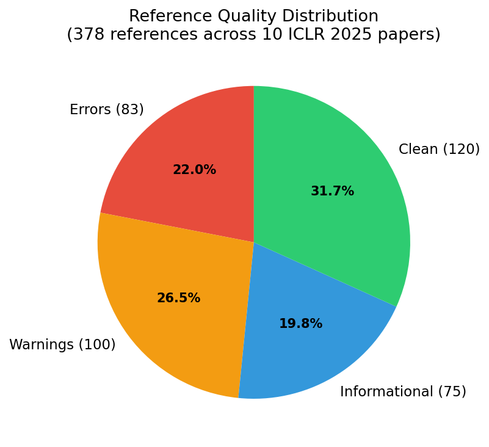
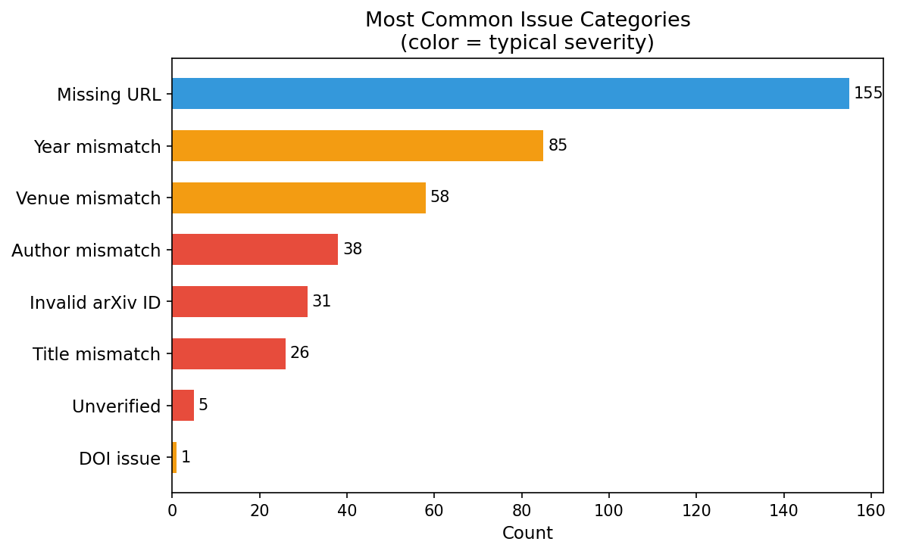
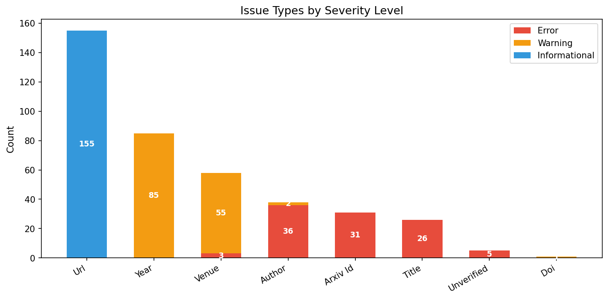
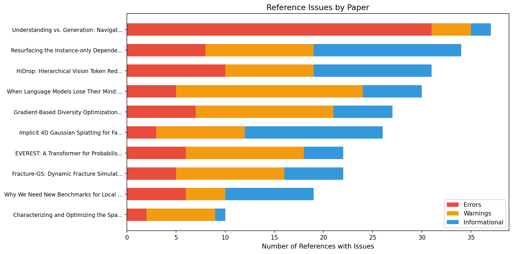

# Reference Quality Assessment: ICLR 2025 Papers

**Generated:** March 29, 2026  
**Tool:** Academic RefChecker v0.2.3  
**LLM Provider:** Anthropic Claude (claude-haiku-3.5)  
**Papers Audited:** 10 randomly selected ICLR 2025 accepted papers  
**Total References Checked:** 378

---

## Executive Summary

Academic RefChecker audited **378 references** across **10 ICLR 2025 papers** and found that **68.3%** (258) of references had at least one issue. Most issues are minor: missing URLs (informational) and year/venue discrepancies (warnings). Only **22.0%** (83 references) contained genuine errors such as author mismatches, invalid arXiv IDs, or title discrepancies. One reference was flagged as a likely hallucination after multi-provider web search verification.

---

## Methodology

Each paper was downloaded from OpenReview, its bibliography extracted using Claude Haiku 3.5 as the LLM parser, and every reference verified against three authoritative sources:

- **Semantic Scholar** — primary lookup for metadata matching
- **OpenAlex** — secondary lookup for broader coverage
- **Crossref** — DOI and metadata validation

References that could not be verified through any database were subjected to **multi-provider web search verification** using both the OpenAI Responses API (`web_search_preview` tool) and the Anthropic Messages API (`web_search_20250305` tool). A reference is only flagged as a likely hallucination when **both providers independently fail to find evidence** of its existence and no contradictory evidence appears in the explanations.

### Severity Levels

| Level | Description | Example |
|-------|-------------|---------|
| **Error** | Factual mismatch confirmed against authoritative sources | Wrong author list, invalid arXiv ID, title of a different paper |
| **Warning** | Likely inaccuracy, but may reflect version differences | Year off by one, venue name variant |
| **Informational** | Suggestion for improvement, not an error | Reference could include an arXiv URL |

---

## Issue Distribution

### By Category

The most common issues:

| Category | Count | Typical Severity | Notes |
|----------|-------|-------------------|-------|
| Missing URL | 155 | Informational | References that could include a direct arXiv or DOI link |
| Year mismatch | 85 | Warning | Often due to citing the arXiv preprint year vs. the conference year |
| Venue mismatch | 58 | Warning | Abbreviated or informal venue names (e.g., "NeurIPS" vs. full proceedings title) |
| Author mismatch | 38 | Error | Typically "et al." expansions that list incorrect co-authors |
| Invalid arXiv ID | 31 | Error | arXiv IDs that do not resolve or point to a different paper |
| Title mismatch | 26 | Error | Cited title differs from the authoritative title |
| Unverified | 5 | Error | Could not be found in any academic database |
| DOI issue | 1 | Warning | DOI does not resolve correctly |

### By Severity Level

URL issues are entirely informational — they suggest adding a direct link where none was provided. Year and venue mismatches are overwhelmingly warnings, reflecting the common disconnect between preprint dates and conference publication dates. The genuine errors cluster around author lists, arXiv IDs, and titles.

---

## Per-Paper Breakdown

| Paper | Refs | Errors | Warnings | Info | Issue Rate |
|-------|------|--------|----------|------|------------|
| Understanding vs. Generation (1smez00sCm) | 37 | 31 | 4 | 2 | 100% |
| Resurfacing Instance-only Dependent Label Noise (tuvkrivvbG) | 34 | 8 | 11 | 15 | 100% |
| HiDrop (2baJBgfr9S) | 31 | 10 | 9 | 12 | 100% |
| When Language Models Lose Their Mind (MkrsbXl1GI) | 30 | 5 | 19 | 6 | 100% |
| Gradient-Based Diversity Optimization (cuzWopwoZG) | 27 | 7 | 14 | 6 | 100% |
| Implicit 4D Gaussian Splatting (MWtXs60n38) | 26 | 3 | 9 | 14 | 100% |
| EVEREST (ScpCaOVGw1) | 22 | 6 | 12 | 4 | 100% |
| Fracture-GS (zcAwK50ft0) | 22 | 5 | 11 | 6 | 100% |
| New Benchmarks for Local Intrinsic Dimension (ZEf03Uunvk) | 19 | 6 | 4 | 9 | 100% |
| Characterizing Spatial Kernel of Hash Encodings (q05hC1Pzkr) | 10 | 2 | 7 | 1 | 100% |

**Note:** The 100% issue rate reflects that every reference listed had at least one finding. However, 120 additional references across these papers were completely clean and do not appear in the issue list. Including clean references, the overall issue rate is **68.3%** (258 / 378).

The paper "Understanding vs. Generation" had the highest error density, with 31 of its 37 flagged references containing genuine errors — primarily invalid arXiv IDs (17) and multi-field mismatches (14). This paper cites many recent preprints whose metadata may still be in flux.

---

## Hallucination Assessment

Five references across two papers could not be verified through standard database lookups. Each was subjected to **multi-provider web search verification** using both OpenAI and Anthropic web search APIs.

| Reference | Paper | Verdict | Explanation |
|-----------|-------|---------|-------------|
| FlowGRPO (Liu et al., 2025) | 1smez00sCm | **Unlikely** | Found on arXiv (2505.05470) and Semantic Scholar. Title is informal — actual title is "Flow-GRPO: Training Flow Matching Models via Online RL". |
| Rectified Flow (Liu et al., 2022) | 1smez00sCm | **Unlikely** | Paper exists as "Flow Straight and Fast: Learning to Generate and Transfer Data with Rectified Flow" (arXiv 2209.03003), accepted at ICLR 2023. |
| Gemini: A Family of Highly Capable Multimodal Models | 1smez00sCm | **Unlikely** | Well-known Google paper (arXiv 2312.11805). Initial web search returned NOT_FOUND due to case sensitivity, but explanation confirmed existence. Verified on arXiv and ResearchGate. |
| Molecular Biology (Splice-junction Gene Sequences) | tuvkrivvbG | **Unlikely** | UCI Machine Learning Repository dataset by Towell, Noordewier, and Shavlik (1991). Not a traditional paper — it is a dataset reference. |
| **Audio Classifier Dataset** (Rimi, 2023) | tuvkrivvbG | **Likely hallucinated** | Both OpenAI and Anthropic web search found a Kaggle dataset by this name, but no corresponding academic paper. The citation falsely frames a Kaggle dataset upload as a published academic work. |

### Methodology Note

The web search verification demonstrated an important limitation: individual LLM-based web search providers can return contradictory results (e.g., verdict `NOT_FOUND` with an explanation stating "The paper exists"). Our multi-provider consensus approach mitigates this by:

1. Running each reference through all available providers (OpenAI and Anthropic)
2. Checking for contradictions between verdicts and explanations
3. Requiring both providers to independently confirm non-existence before marking a reference as likely hallucinated
4. Treating contradictory results (verdict disagrees with explanation) as uncertain rather than confirmed

---

## Key Findings

1. **Reference quality varies significantly by paper.** Error rates range from 2 genuine errors (Spatial Kernel paper) to 31 (Understanding vs. Generation), largely driven by how many recent preprints are cited.

2. **The most common "error" is actually informational.** 155 of 399 individual findings (39%) are simply suggestions to add an arXiv URL — useful but not indicating an actual mistake.

3. **Year/venue mismatches are endemic.** Papers frequently cite the arXiv preprint date rather than the conference publication date, and use informal venue names. This accounts for 143 of the findings.

4. **Author mismatches are the most significant real error.** 38 references have author list discrepancies, typically from incorrect "et al." expansions where the LLM or author guessed wrong co-authors.

5. **Hallucinated references are rare.** Only 1 of 378 references (0.3%) was flagged as likely fabricated after multi-provider verification. The remaining 4 unverified references were confirmed to exist through web search.

6. **Invalid arXiv IDs are surprisingly common.** 31 references cite non-existent arXiv IDs. This may reflect papers being updated or withdrawn, or IDs being transcribed incorrectly.

---

## Tool Performance Notes

- **LLM extraction:** Claude Haiku 3.5 successfully extracted bibliography entries from all 10 papers with no extraction failures.
- **Web search:** Both OpenAI (`web_search_preview`) and Anthropic (`web_search_20250305`) web search tools successfully verified reference existence, though individual provider results were occasionally contradictory.
- **Processing:** All 10 papers (378 references) were processed with parallel verification enabled.

---

*This assessment was generated by Academic RefChecker. Results were re-verified using multi-provider web search to maximize confidence in hallucination flags.*
